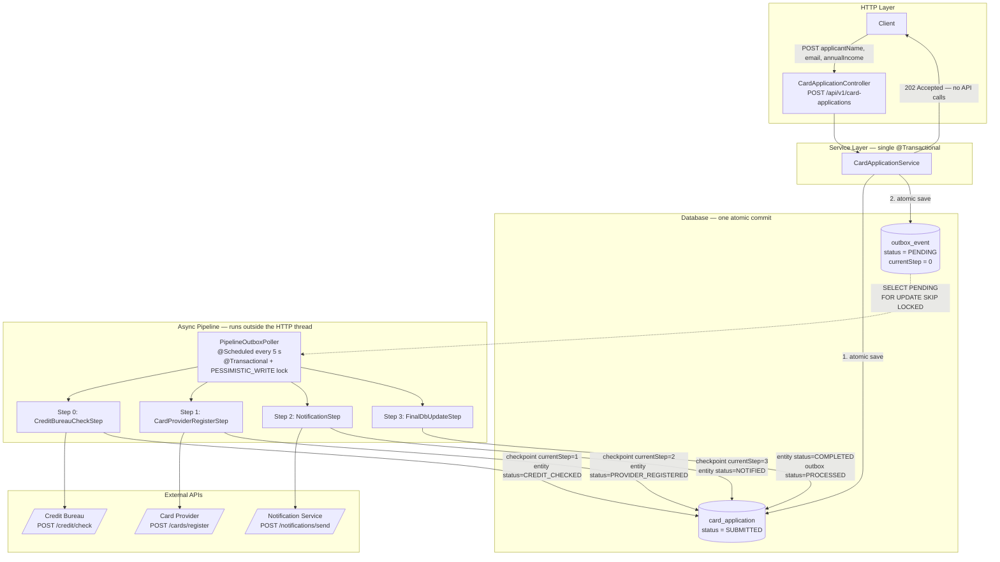
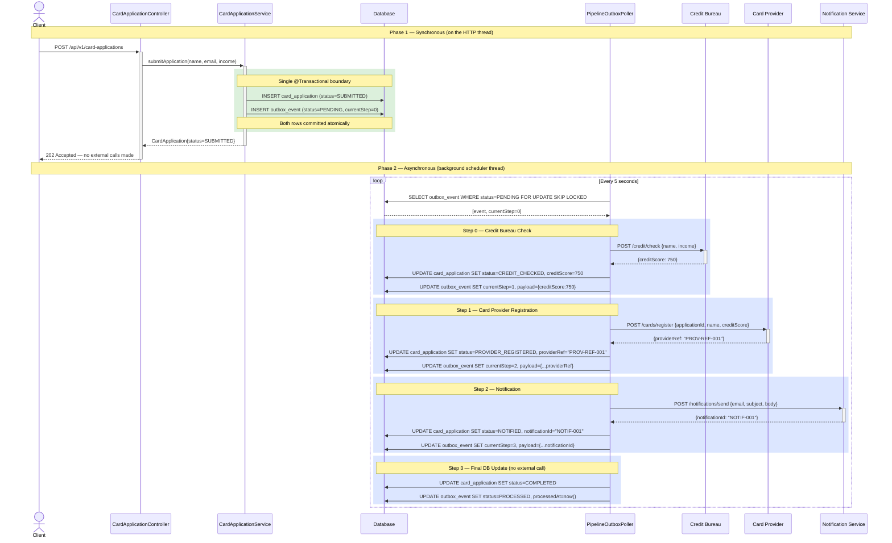
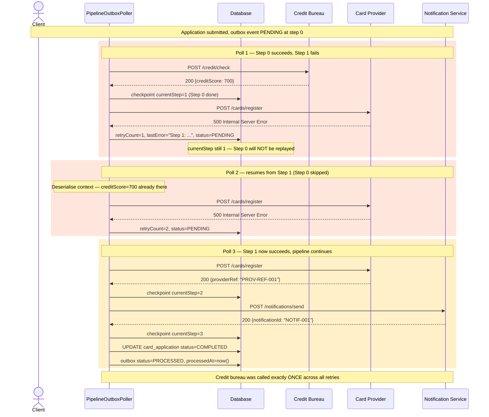
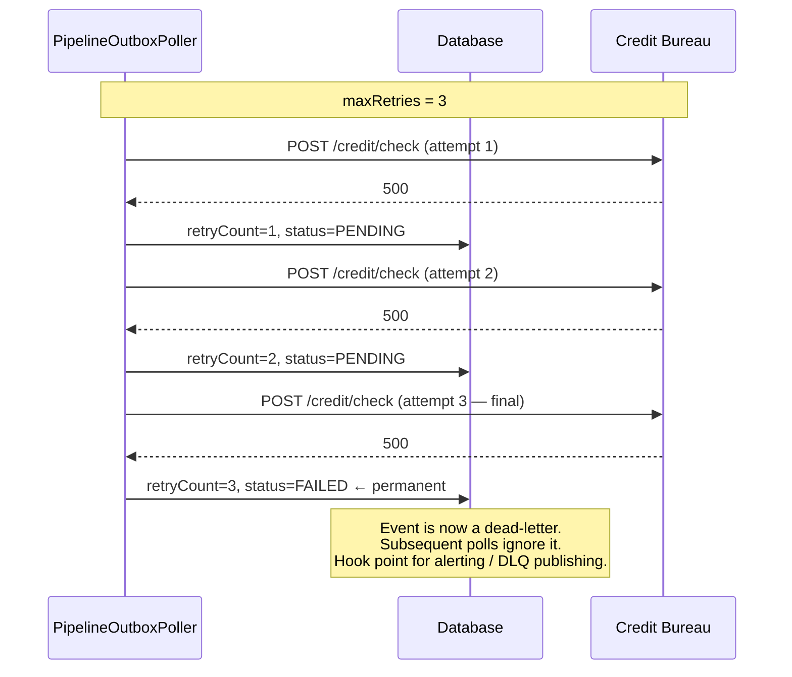
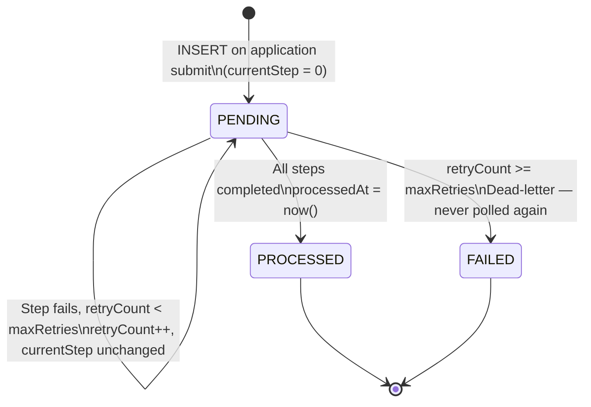
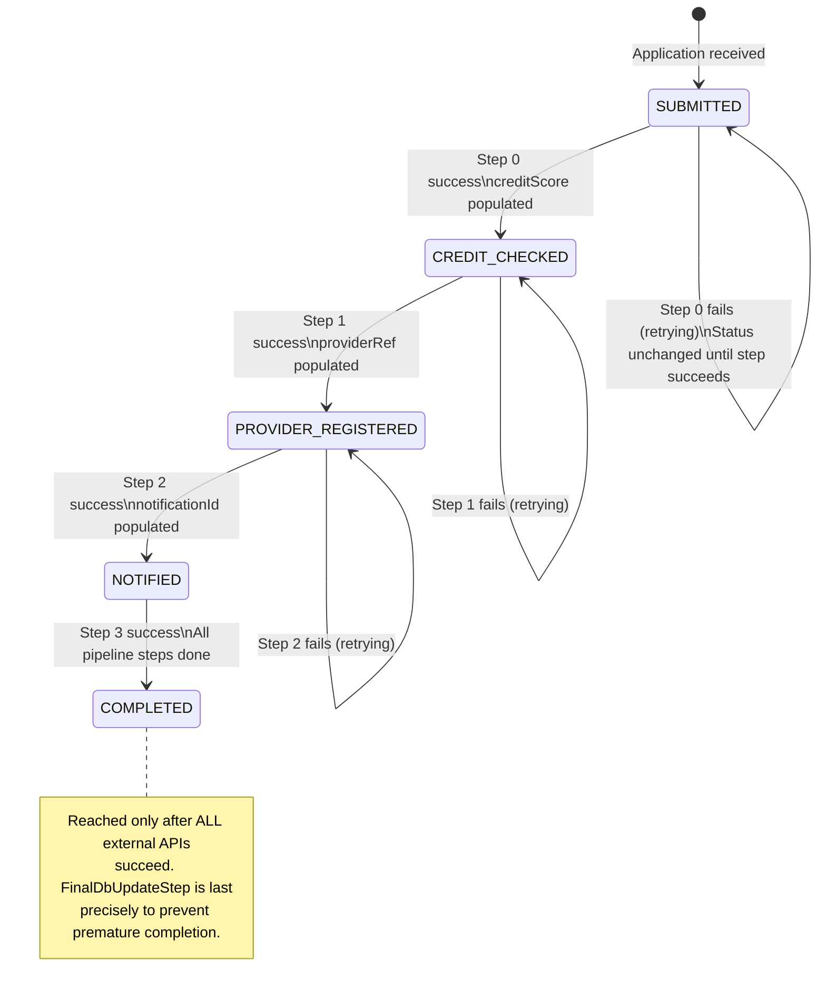

# Transactional Outbox Pattern

## Table of Contents

1. [The Problem: Dual-Write Hazard](#1-the-problem-dual-write-hazard)
2. [The Solution: Transactional Outbox](#2-the-solution-transactional-outbox)
3. [Architecture Overview](#3-architecture-overview)
4. [Domain Model](#4-domain-model)
5. [Happy Path](#5-happy-path)
6. [Failure Handling and Retry](#6-failure-handling-and-retry)
7. [Entity State Machines](#7-entity-state-machines)
8. [Checkpoint Mechanism](#8-checkpoint-mechanism)
9. [Pipeline Steps](#9-pipeline-steps)
10. [Database Schema](#10-database-schema)
11. [Configuration Reference](#11-configuration-reference)
12. [Running Locally](#12-running-locally)
13. [Test Strategy](#13-test-strategy)

---

## 1. The Problem: Dual-Write Hazard

A common pattern in microservices is to save a record to a database **and** publish an event (or call an external API) in the same operation. This is the **dual-write problem**: two distinct systems must both succeed, but there is no distributed transaction spanning them.

```
// DANGEROUS — two operations, only one transaction
db.save(application);           // ← if this commits...
externalApi.call(application);  // ← ...but this fails, we have an inconsistency
```

The failure modes are symmetric:

| Failure point | Consequence |
|---|---|
| DB save succeeds, API call fails | Record exists in DB, but downstream never processed it |
| API call succeeds, DB save fails | Downstream acted on data that doesn't exist in DB |

In a credit card application flow this means an applicant could be charged by a card provider but have no record of an approved application — a serious data integrity violation.

---

## 2. The Solution: Transactional Outbox

The Transactional Outbox pattern eliminates the dual-write hazard by:

1. **Never calling external APIs inside a transaction.** The transaction only writes to the database.
2. **Writing an intent record** (`outbox_event`) atomically alongside the business record (`card_application`). If the transaction rolls back, both disappear together.
3. **Deferring all external calls** to a background poller that reads pending outbox events and drives them through a pipeline.
4. **Checkpointing progress** after each step so that retries resume from where they left off, not from the beginning.

The guarantee: **either the business record and the outbox event both exist, or neither does.**

---

## 3. Architecture Overview



**Key design choices:**

- The HTTP request returns `202 Accepted` **immediately** after the atomic DB write. No external API latency is on the critical path.
- The `PESSIMISTIC_WRITE` lock on the outbox query prevents two pods from executing the same event concurrently (safe for horizontal scaling).
- Each step checkpoints its progress into the outbox row so a crash mid-pipeline does not replay already-completed steps.

---

## 4. Domain Model

### `CardApplication` — the business record

| Field | Type | Description |
|---|---|---|
| `id` | UUID | Primary key |
| `applicantName` | String | Full name of the applicant |
| `email` | String | Email for notification |
| `annualIncome` | BigDecimal | Used in credit scoring |
| `status` | Enum | Current stage in the pipeline (see state machine) |
| `creditScore` | Integer | Populated by Step 0 |
| `providerRef` | String | Populated by Step 1 |
| `notificationId` | String | Populated by Step 2 |
| `createdAt` | Timestamp | Immutable creation time |
| `updatedAt` | Timestamp | Updated on every status change |

### `OutboxEvent` — the pipeline driver

| Field | Type | Description |
|---|---|---|
| `id` | UUID | Primary key |
| `correlationId` | UUID | Foreign key to `card_application.id` |
| `pipelineType` | String | `CARD_APPLICATION_PIPELINE` — routes to the right steps |
| `currentStep` | int | Next step index to execute (0-based). **The checkpoint.** |
| `totalSteps` | int | Total steps in the pipeline (4) |
| `status` | Enum | `PENDING` / `PROCESSED` / `FAILED` |
| `payload` | TEXT | JSON-serialised `CardApplicationContext` — mutated between steps |
| `retryCount` | int | Number of failed attempts so far |
| `lastError` | String | Error message from the most recent failure |
| `createdAt` | Timestamp | When the event was enqueued |
| `processedAt` | Timestamp | Set when reaching `PROCESSED` or `FAILED` |

### `CardApplicationContext` — the shared pipeline context

Passed between steps and serialised into `outbox_event.payload` after each checkpoint:

```
┌──────────────────────────────────────────┐
│  CardApplicationContext                   │
│  ─────────────────────────────────────── │
│  applicationId   (input)                  │
│  applicantName   (input)                  │
│  email           (input)                  │
│  annualIncome    (input)                  │
│                                           │
│  creditScore     ← set by Step 0          │
│  providerRef     ← set by Step 1          │
│  notificationId  ← set by Step 2          │
└──────────────────────────────────────────┘
```

---

## 5. Happy Path



---

## 6. Failure Handling and Retry

When any step throws an exception the poller **does not re-start the pipeline from Step 0**. It increments `retryCount`, persists the error, and leaves the event as `PENDING`. The next poll cycle resumes from `currentStep` — the last successfully checkpointed step.

After `maxRetries` failures the event is permanently moved to `FAILED` (dead-letter state) and is never polled again.



### Permanent Failure (Dead-Letter)



---

## 7. Entity State Machines

### `OutboxEvent` status



### `CardApplication` status



**The `FAILED` status on `CardApplication` is not set automatically.** The entity reflects the last *successfully* executed step, which makes it easy to diagnose exactly where the pipeline stalled when an outbox event moves to `FAILED`.

---

## 8. Checkpoint Mechanism

The checkpoint is the single most important resilience property in this implementation.

```
outbox_event
┌────────────────┬───────────────────────────────────────────────┐
│ currentStep    │ Meaning                                        │
├────────────────┼───────────────────────────────────────────────┤
│ 0              │ No steps run yet — start from Step 0           │
│ 1              │ Step 0 done — resume from Step 1               │
│ 2              │ Steps 0–1 done — resume from Step 2            │
│ 3              │ Steps 0–2 done — resume from Step 3            │
│ 4              │ All 4 steps done — event will be PROCESSED     │
└────────────────┴───────────────────────────────────────────────┘
```

After each step the poller does two writes **before** moving to the next step:

1. `outbox_event.currentStep = i + 1` — advances the checkpoint
2. `outbox_event.payload = serialize(context)` — persists step outputs (e.g., `creditScore`)

If the process crashes between Step 1 and Step 2, the next poll sees `currentStep = 2` and begins there. The Credit Bureau is never called a second time. `creditScore` is recovered from the serialised payload.

```java
// PipelineOutboxPoller — core loop
for (int i = event.getCurrentStep(); i < steps.size(); i++) {
    boolean continueExecution = steps.get(i).execute(context);

    // Checkpoint after every successful step
    event.setCurrentStep(i + 1);
    event.setPayload(objectMapper.writeValueAsString(context));
    outboxEventRepository.save(event);

    if (!continueExecution) { /* early exit */ return; }
}
```

---

## 9. Pipeline Steps

All four steps implement `PipelineStep<CardApplicationContext>`. The registry auto-discovers them by Spring component scan and sorts by `getStepIndex()`.

| Index | Class | External Call | Entity Status After |
|---|---|---|---|
| 0 | `CreditBureauCheckStep` | `POST /credit/check` | `CREDIT_CHECKED` |
| 1 | `CardProviderRegisterStep` | `POST /cards/register` | `PROVIDER_REGISTERED` |
| 2 | `NotificationStep` | `POST /notifications/send` | `NOTIFIED` |
| 3 | `FinalDbUpdateStep` | None — deterministic | `COMPLETED` |

Step 3 is intentionally last. `COMPLETED` is set only when every external API has succeeded. If Step 2 (notification) were never added, `COMPLETED` would still be unreachable until the pipeline exhausts or succeeds.

### Adding a new step

1. Create a class implementing `PipelineStep<CardApplicationContext>`.
2. Annotate it `@Component`.
3. Return the correct `getStepIndex()` — insert between existing steps by adjusting indices.
4. The `PipelineRegistry` discovers and sorts it automatically. No changes to the poller needed.

---

## 10. Database Schema

```sql
-- Business record — source of truth for application state
CREATE TABLE card_application (
    id               UUID         PRIMARY KEY,
    applicant_name   VARCHAR(200) NOT NULL,
    email            VARCHAR(200) NOT NULL,
    annual_income    NUMERIC(15,2) NOT NULL,
    status           VARCHAR(30)  NOT NULL DEFAULT 'SUBMITTED',
    credit_score     INTEGER,
    provider_ref     VARCHAR(100),
    notification_id  VARCHAR(100),
    created_at       TIMESTAMP    NOT NULL DEFAULT NOW(),
    updated_at       TIMESTAMP    NOT NULL DEFAULT NOW()
);

-- Pipeline driver — persisted atomically with card_application
CREATE TABLE outbox_event (
    id              UUID         PRIMARY KEY,
    correlation_id  UUID         NOT NULL,        -- → card_application.id
    pipeline_type   VARCHAR(100) NOT NULL,
    current_step    INTEGER      NOT NULL DEFAULT 0,
    total_steps     INTEGER      NOT NULL,
    status          VARCHAR(20)  NOT NULL DEFAULT 'PENDING',
    payload         TEXT         NOT NULL,        -- JSON CardApplicationContext
    retry_count     INTEGER      NOT NULL DEFAULT 0,
    last_error      TEXT,
    created_at      TIMESTAMP    NOT NULL DEFAULT NOW(),
    processed_at    TIMESTAMP
);

-- Partial index: only PENDING rows — keeps the poller query fast as PROCESSED/FAILED accumulate
CREATE INDEX idx_outbox_pending
    ON outbox_event (status, created_at)
    WHERE status = 'PENDING';
```

The partial index on `WHERE status = 'PENDING'` is critical for production performance. As the `outbox_event` table grows with millions of `PROCESSED` and `FAILED` rows, the poller's `SELECT` only scans the small subset of rows that actually need work.

---

## 11. Configuration Reference

```yaml
app:
  api:
    credit-bureau-url: http://credit-bureau-service   # Base URL for Step 0
    card-provider-url: http://card-provider-service    # Base URL for Step 1
    notification-url:  http://notification-service     # Base URL for Step 2

  outbox:
    poll-delay-ms: 5000     # Milliseconds between poller executions (fixed delay)
    poll-batch-size: 10     # Max events fetched per poll cycle
    max-retries: 3          # Permanent failure after this many failed attempts
```

**`poll-delay-ms` uses `fixedDelay`**, not `fixedRate`. The next poll begins only after the previous one finishes. Under high load with large batches, polls will naturally space out without overlapping.

---

## 12. Running Locally

### Prerequisites

- Java 17+
- Docker (for PostgreSQL)

### Start the database

```bash
docker run --rm \
  -e POSTGRES_DB=outbox_demo \
  -e POSTGRES_USER=postgres \
  -e POSTGRES_PASSWORD=postgres \
  -p 5432:5432 \
  postgres:15
```

### Run the application

```bash
./mvnw spring-boot:run
```

Flyway runs on startup and creates both tables.

### Submit an application

```bash
curl -X POST http://localhost:8080/api/v1/card-applications \
  -H "Content-Type: application/json" \
  -d '{"applicantName":"Jane Doe","email":"jane@example.com","annualIncome":72000}'
```

Response (`202 Accepted`):
```json
{
  "id": "3fa85f64-5717-4562-b3fc-2c963f66afa6",
  "applicantName": "Jane Doe",
  "email": "jane@example.com",
  "status": "SUBMITTED"
}
```

### Poll application status

```bash
curl http://localhost:8080/api/v1/card-applications/3fa85f64-5717-4562-b3fc-2c963f66afa6
```

After the poller runs (within ~5 seconds), `status` will advance through `CREDIT_CHECKED` → `PROVIDER_REGISTERED` → `NOTIFIED` → `COMPLETED`.

### Run the tests

```bash
./mvnw test
```

Tests use H2 in-memory database (PostgreSQL compatibility mode) and WireMock for external APIs. No external dependencies are needed.

---

## 13. Test Strategy

### Unit tests (`src/test/java`)

| Class | Covers |
|---|---|
| `CardApplicationServiceTest` | Atomic save of entity + outbox event; GET lookup |
| `OutboxServiceTest` | Outbox event creation; rejects unknown pipeline types |
| `PipelineOutboxPollerTest` | Full retry lifecycle; checkpoint preservation; early exit; no-steps edge case |
| `PipelineRegistryTest` | Step ordering; multi-pipeline isolation; `hasPipeline()` predicate |
| `PipelineStepTest` | Each step's external call, context mutation, entity status update |
| `CardApplicationControllerTest` | Input validation (email format, positive income); response codes |

### Integration tests (H2 + WireMock)

| Class | Focus |
|---|---|
| `CardApplicationIntegrationTest` | End-to-end happy path; atomicity guarantee; status progression; checkpoint test; permanent failure; concurrent batch |
| `OutboxPatternConsistencyIT` | **Robustness emphasis** — intermittent failures, terminal state immutability, partial-pipeline entity consistency, 4xx/malformed-response handling, mixed-batch isolation |

### What integration tests prove that unit tests cannot

- The `@Transactional` boundary actually commits both rows together (requires a real DB connection).
- The poller's `PESSIMISTIC_WRITE` lock actually prevents double-execution (requires DB-level locking).
- The partial index on `outbox_event` means FAILED/PROCESSED events are invisible to subsequent polls (requires query execution on a real engine).
- The WireMock scenario API proves that retries eventually converge after intermittent failures.
